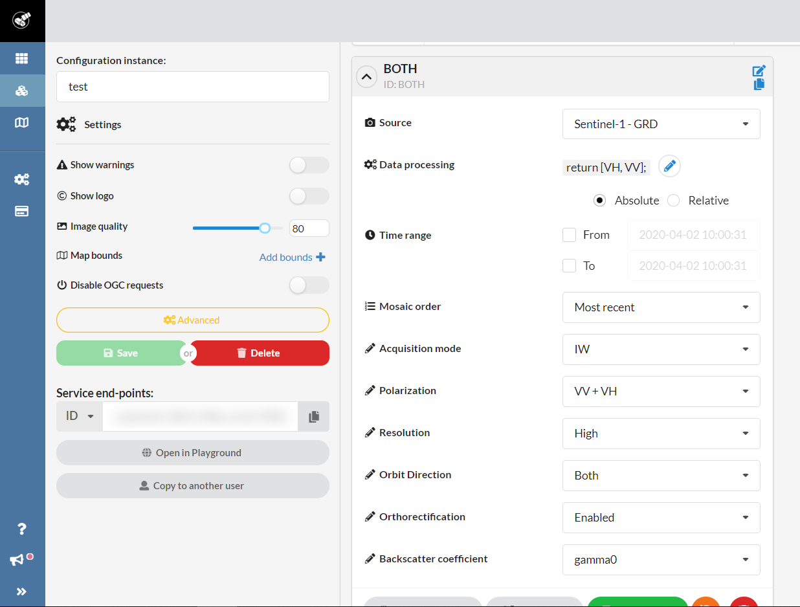

# PARKING OCCUPANCY ESTIMATION ON SENTINEL-1 IMAGES

Implementation for our ISPRS 2020 paper [PARKING OCCUPANCY ESTIMATION ON SENTINEL-1 IMAGES](https://www.isprs-ann-photogramm-remote-sens-spatial-inf-sci.net/V-2-2020/821/2020/).

Authors:
* Sébastien Drouyer ([Website](http://sebastien.drouyer.com/), [Github](https://github.com/sdrdis), [Twitter](https://twitter.com/sdrdis))
* Carlo de Franchis ([Website](http://cdefranc.perso.math.cnrs.fr/), [Github](https://github.com/carlodef))


## Step 1: generation of positions files

Positions can be generated from KMLs for example:

```
python utils_generate_positions_from_kmls.py kmls_folder id
```

Where `kmls_folder` is a folder containing kmls and `id` is an identifier (for example "retail_parkings")

Generates a NPZ file containing coordinates of all parkings to monitor in the `positions` folder.

For example, you can run the following command:

```
python utils_generate_positions_from_kmls.py sample_kml_folders test_parkings.npz
```

That will generate the `positions/test_parkings.npz` file.

This file can be opened with python:

```
import numpy as np
data = np.load('positions/test_parkings.npz')
data['shapes'] # contains all parkings coordinates
data['dirnames'] # contains filenames of kmls
``` 

## Step 2: generate dataset

Prior to this step, we assume that you have created a sentinel-hub instance and that you have added the `BOTH` layer configured as shown below.



Generate dataset (example below from sentinel-hub website)

```
python generate_dataset_sentinelhub.py id sentinel_hub_instance_id
```

Where `id` is an identifier (for example "retail_parkings"), and `sentinel_hub_instance_id` is the Sentinel-hub instance id.

Generates folders in `data/{id}` containing images.

## Step 3: evaluate masks

### First way: simple mask

Generate parking masks.

```
python generate_masks.py
```

Generates images (all ids) in `data` indicating where the parking is and where it is not.

### Second way: mask minus always occupied areas


Generate parking masks.

```
python generate_stats_per_orbit.py id
python generate_masks_minus_always_occupied.py id
```

Where `id` is an identifier (for example "retail_parkings").

`generate_stats_per_orbit.py` generates stats per orbit (median, std, min).

`generate_masks_minus_always_occupied.py` generates a mask removing areas where it is always occupied.

## Step 4: evaluate occupancy

Estimate occupancy rates.

### First way: simple thresholding

```
python estimate_simple.py
```

Applies a simple thresholding on all images (all ids). See parameters `python estimate_simple.py --help`.

### Second way: thresholding compared to weekends

TODO

## Step 5: generate csv

CSV are generated using following script:

```
python generate_csvs.py id
```

Where `id` is an identifier (for example "retail_parkings").

CSVs and graphs are generated in the `output_csv/{id}` folder.